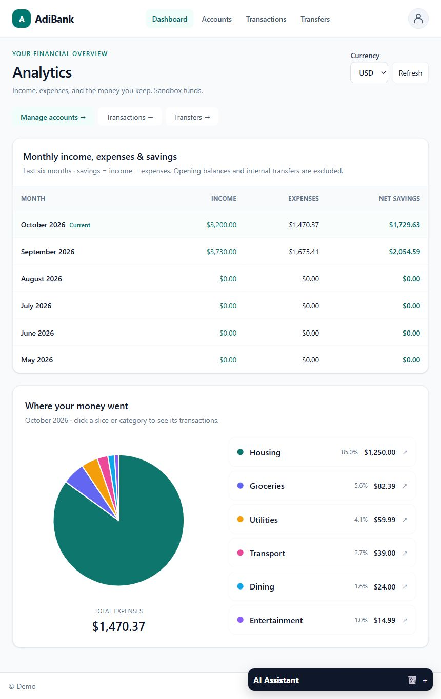

# AdiBank Copilot

**Try the live version: [adibanking-copilot.vercel.app](https://adibanking-copilot.vercel.app/).** No installation is needed to explore the hosted application. The repository continues to evolve, so deployment features may differ from the current local version. The demo-account dropdown appears when enabled by the deployment.

AdiBank Copilot is a portfolio banking application built by **aadish**. It combines account management, transaction history, sandbox transfers, monthly financial analytics, and an application-scoped banking assistant. It uses sample money and seeded identities with real authentication and a persistent database.

**For demonstration purposes only.** This is not a bank or payment service. Public demo identities share their sample records with visitors using the same login; enter only sample information.

## Purpose

The project demonstrates the full journey from signing in to understanding and managing financial activity. Visitors can explore an admin or customer account, review cash flow, drill into spending categories, and change sandbox records while keeping balances and ledger entries consistent.

Its engineering purpose is to connect a usable frontend to meaningful backend behavior: verified sessions, enforced ownership, exact money arithmetic, atomic database changes, and safe retries. Role-based navigation improves the experience, while independent server checks and database policies enforce access.

## Current features

- **Authentication:** Supabase email/password login, protected routes, cookie session refresh, logout, and an opt-in demo credential dropdown that fills the login form.
- **Profiles:** edit name, email, phone, city, and country. Email changes require Supabase confirmation.
- **Roles:** customers manage their own banking records. Admins also see the user directory; they do not bypass banking ownership.
- **Analytics landing page:** six months of income, expenses, and net savings; current-month expense categories; clickable pie slices and keyboard-accessible legend buttons opening a transaction modal. Aggregation respects timezone and keeps currencies separate.
- **Accounts:** create zero-balance checking/savings accounts, rename them, change status, and delete empty accounts without history.
- **Transactions:** create, search, edit, and remove manual income/expense entries. Balance changes are atomic. Generated opening, transfer, and reversal entries are protected.
- **Transfers:** move sandbox funds between the user's active accounts in the same currency, view receipts, edit amounts, and reverse/archive transfers. Retry keys prevent duplicate financial effects.
- **Banking assistant:** authenticated account/transaction retrieval, monthly summaries, spending categories, profile help, and signed transfer confirmations. Unsupported requests are refused; retries reuse the same transfer key.
- **UI:** responsive navigation, profile menu, forms, loading/error/empty states, and confirmation dialogs.



## Tech stack

| Layer | Technology | Purpose |
| --- | --- | --- |
| Application | Next.js 16 App Router, React 19, TypeScript | Server pages, client interactions, server actions, route handlers |
| Styling | Tailwind CSS 4 | Responsive layouts, forms, and cards |
| Authentication | Supabase Auth and SSR helpers | Verified users, cookie sessions, token refresh |
| Database | Supabase PostgreSQL | Accounts, ledger, transfers, audit/retry records, analytics |
| Authorization | Server role checks and PostgreSQL RLS | Admin-only directory and user-owned financial data |
| Validation | Zod | API input/output validation |
| Assistant | Closed command grammar, authenticated APIs, HMAC confirmations | Grounded reads and reviewed sandbox transfers without external model output |
| Testing | Jest, PGlite, hosted API verification scripts | Unit tests, actual SQL tests, integration checks |
| Delivery | Vercel, GitHub Actions, Node.js 22 | Live hosting and CI quality checks |

## Architecture and trade-offs

**Ownership is enforced at multiple layers.** The server verifies sessions and feature permissions. Row-level security scopes financial reads to the authenticated owner, and mutation functions check ownership again. Service-role access stays server-only for setup and the admin directory; normal banking uses authenticated user access.

**Money uses integer cents.** Bounded integer values and decimal-string parsing avoid floating-point rounding errors. This currently assumes two decimal places; exchange rates and currencies with different minor units are not implemented.

**Atomic changes prioritize correctness.** Account locks, balances, ledger entries, and saved retry results run together in PostgreSQL. The UI accepts canonical server balances rather than optimistic updates. This adds SQL complexity and request latency, but prevents partial changes and duplicate transfers.

**CRUD preserves ledger history.** Manual sandbox entries can be corrected or removed; generated entries are protected. Removing a transfer reverses funds and archives its receipt, preserving the original retry key. These constraints demonstrate reconciliation rather than production banking compliance.

**Persistent mode is explicit.** `BANKING_DATA_SOURCE=supabase` uses PostgreSQL; `demo` provides fixture-only reads. Failed database queries do not silently substitute mocks, which makes outages visible and prevents misleading success messages.

**Analytics and lists have different scaling limits.** Analytics aggregates full eligible history in PostgreSQL, excluding opening balances and internal transfers. Transaction/transfer lists currently load the newest 200 rows and search locally. Larger datasets need server filtering and pagination.

**The assistant uses an enforceable command scope.** Recognized commands retrieve owned data or prepare signed transfer confirmations. Unknown or compound prompts are refused, with no external-model dependency. This favors predictable banking behavior over unrestricted conversation. History is browser-local rather than cross-device, and rate limiting is per process; see [assistant behavior](docs/ASSISTANT.md).

**Public demo accounts make exploration easy.** The opt-in selector publishes only three designated sandbox credentials. Visitors sharing an identity can see each other's sample changes. Separate accounts are needed for privacy; signup and automatic account provisioning are not implemented yet.

## Run locally

Use the **[live app](https://adibanking-copilot.vercel.app/)** if you only want to try the project. Local development requires **Node.js 22.x**, npm, Git, and your own Supabase project with email/password authentication enabled. The banking assistant does not require an OpenAI API key.

### 1. Install

```sh
git clone https://github.com/aadishrath/adibanking-copilot.git
cd adibanking-copilot
npm ci
```

Copy the environment template:

```powershell
# Windows PowerShell
Copy-Item .env.example .env.local
```

```sh
# macOS / Linux
cp .env.example .env.local
```

### 2. Configure .env.local

| Variable | Purpose |
| --- | --- |
| `NEXT_PUBLIC_SUPABASE_URL` | Supabase project URL |
| `NEXT_PUBLIC_SUPABASE_PUBLISHABLE_KEY` | Public key for authenticated user access |
| `SUPABASE_SERVICE_ROLE_KEY` | Server-only demo-user setup and admin directory key |
| `NEXT_PUBLIC_APP_URL` | `http://localhost:3000` for default local development |
| `DATABASE_URL` | Server-only PostgreSQL Session pooler URI on port 5432, for migrations |
| `BANKING_DATA_SOURCE` | `supabase` after setup; `demo` for fixture-only reads |
| `DEMO_LOGIN_ENABLED` | `true` to show public sandbox credentials on the login page |
| `DEMO_LOGIN_ACCOUNTS` | Optional JSON array for hosting; empty locally reads ignored `.env.demo-users.json` |
| `CHAT_TRANSFER_SIGNING_SECRET` | Server-only random secret of at least 32 characters for signed chat transfer confirmations |
| `DATABASE_CA_CERT_PATH` | Optional alternative Supabase root CA path |

Never commit `.env.local` or put database passwords, service-role keys, or OpenAI keys in `NEXT_PUBLIC_` variables. Set the Supabase Auth Site URL to the app origin and allow `http://localhost:3000/auth/callback` as a redirect URL.

### 3. Initialize a fresh sandbox database

Run this sequence **only against a new, dedicated demo project**. Schema migrations are one-time setup commands. If your project is already configured, skip migrations and inspect its applied schema first.

```sh
npm run seed:users
npm run db:migrate
npm run db:migrate -- --migration=202610040002_crud.sql
npm run db:migrate -- --migration=202610040003_analytics.sql --activity --analytics-activity
npm run db:migrate -- --migration=202610050001_account_types.sql --credit-activity
npm run db:migrate -- --migration=202610050002_credit_transfers.sql
npm run db:migrate -- --migration=202610050003_session_security.sql
```

The scripts create three confirmed Supabase identities, seed checking/savings accounts and sample activity, and install transfer, CRUD, and analytics functions. Generated passwords go into ignored `.env.demo-users.json`. After setup, set `BANKING_DATA_SOURCE=supabase` and optionally `DEMO_LOGIN_ENABLED=true`.

| Demo identity | Role |
| --- | --- |
| `admin@adibank.example` | Admin |
| `maya@adibank.example` | Customer |
| `alex@adibank.example` | Customer |

These `.example` addresses cannot receive email confirmations. Repeated user seeding preserves existing users and passwords. See [authentication setup](docs/AUTH_SETUP.md) and [database setup](docs/BANKING_DATA_SETUP.md) for details and connection troubleshooting.

### 4. Start

```sh
npm run dev
```

Open [localhost:3000](http://localhost:3000). Choose a demo identity, then click **Sign in**. If the selector is disabled, enter credentials from your local credential file manually.

For a local production build:

```sh
npm run build
npm start
```

## Verification

Routine checks do not require a hosted database:

```sh
npm run lint
npm run type-check
npm test
npm run test:database
npm run build
```

Database tests run actual SQL in isolated PGlite PostgreSQL, including RLS, exact-cent arithmetic, retries, rollback, CRUD balance effects, and analytics boundaries.

For integration checks, run the app on port 3100 (`npm run dev -- --port 3100`) with configured, seeded Supabase data:

```sh
npm run verify:auth
npm run verify:banking -- --app
npm run verify:analytics
npm run verify:assistant
# Sandbox mutations: restores balances, retains audit/reversal history.
npm run verify:crud
```

Run these sequentially against a disposable demo environment. CRUD checks create temporary records, so concurrent read checks may observe intermediate state. Browser flows have been manually checked; automated Playwright, performance/Lighthouse tests, and production monitoring remain future work. GitHub Actions runs routine checks, not deployment.

## Structure and next steps

```text
app/          Pages, auth actions, protected APIs, shared layout
components/   Login, navigation, banking workspace, analytics, assistant
lib/          Auth, data adapters, validation, money and analytics helpers
supabase/     SQL migrations, sample data, database certificate bundle
scripts/      Setup, diagnostics, integration verification
tests/        Unit and isolated PostgreSQL tests
docs/         Setup, behavior, screenshots, deployment notes
```

Read [implementation progress](IMPLEMENTATION_PROGRESS.md), [banking operations](docs/CRUD_WORKSPACE.md), [analytics](docs/ANALYTICS.md), and [deployment configuration](docs/DEPLOYMENT.md) for deeper details. Remaining work includes signup/provisioning, server pagination, fuller transaction/transfer detail flows, spending comparisons, cross-device assistant conversations, and broader automated workflow coverage. See [responsive UI](docs/RESPONSIVE_UI.md) for the phone/tablet layout and [assistant](docs/ASSISTANT.md) for supported prompts, configuration, and failure handling.

---

© 2026 aadish. Built by aadish. For demonstration purposes only. This notice identifies the author and demo purpose; it does not establish an open-source license.

### Additional demo accounts

Each demo user has Checking, Savings, Retirement, Investment, Mortgage, Loan, and Credit Card accounts. Mortgage, Loan, and Credit Card balances represent amounts owed. Mortgage and Loan accounts cannot fund transfers; a payment from an asset account reduces both its funds and the destination debt. Card charges increase debt and are limited by available credit. The card demo includes four purchases, a $100 checking payment, a $5,000 limit and $135.99 outstanding. Purchases can be edited/deleted in Transactions, and payments edited/reversed in Transfers. Opening balances and payment ledger entries are protected. Retirement/investment balances are simulated cash, without trading; loans/cards do not accrue interest or implement statement cycles.

New demo users receive eight-character passwords. To explicitly reset the three existing demo users only, run `npm run seed:users -- --reset-demo-passwords`. Credentials are stored in the ignored `.env.demo-users.json`; the enabled login demo dropdown reads this file. Update `DEMO_LOGIN_ACCOUNTS` separately if your deployment uses that environment override.

Credit cards can fund sandbox cash advances up to available credit (limit minus amount owed), even when the transfer exceeds the current card balance. Advances increase card debt and credit the destination; edits/reversals adjust both balances atomically. Matching currencies and account ownership are required. Mortgage/Loan accounts accept payments only. No cash-advance fees, interest, retirement withdrawal penalties, or real-world account restrictions are simulated.

Banking endpoints validate identity and active Supabase session state. Database RLS and mutation functions also require an active session, blocking saved access tokens after logout. Private demo fixtures live in `lib/fixtures`; former `/mock-data/*.json` URLs are unavailable. API bodies never include credentials or banking data on authentication failure. Public demo login credentials remain intentionally public when demo login is enabled.
