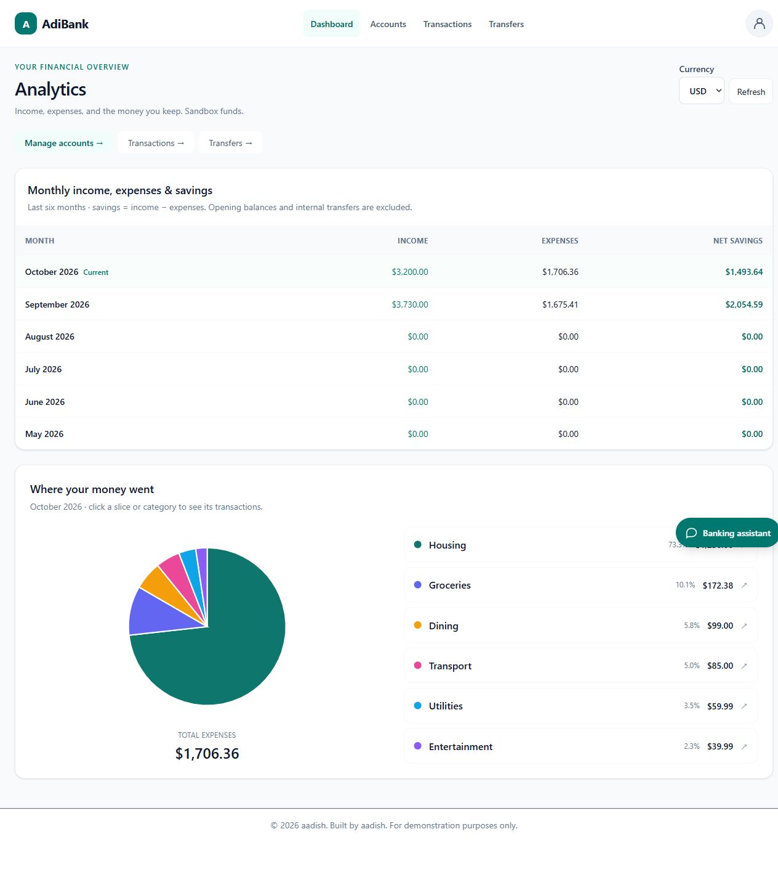
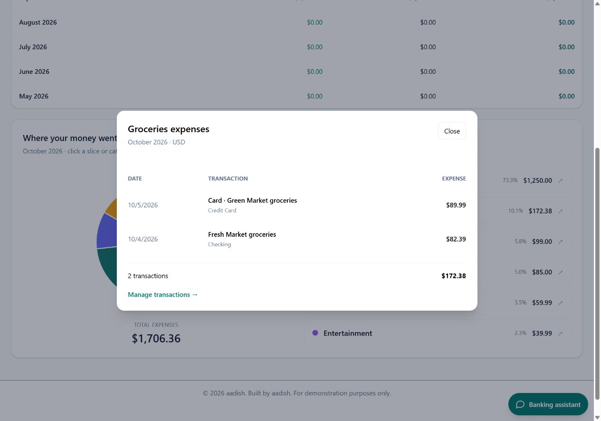

# Analytics landing page

After login, `/dashboard` now displays analytics backed by the signed-in user's Supabase ledger. Account, transaction, and transfer CRUD remain available through their navigation links.

- Monthly table: the last six calendar months, newest first, including zero-activity months. Income is positive manual activity; expenses are the absolute value of negative manual activity; net savings is income minus expenses. This is cash flow, not the balance of a savings account.
- Pie chart: current-month expenses grouped by category, with percentages and totals. Both SVG slices and legend buttons open a native modal with that category's current-month expense transactions, dates, descriptions, account names, and a reconciled total. Slices support Enter/Space; the modal supports Escape, focus containment, and return focus.
- Currency: USD/EUR/GBP are analyzed separately. There is no conversion or summation of different currencies.
- Month boundaries: use the browser's IANA time zone, validated by the API and database. Boundaries include the start of the local month and exclude the start of the next month.
- Manual credit-card purchases count as expenses alongside cash-account spending. Card payments and cash advances are internal transfers, so they are not counted again as expenses or income. Opening balances, internal transfer entries, and reversal entries are excluded from income/expense analytics. All eligible history is aggregated in PostgreSQL; the workspace's 200-record display limit does not truncate totals or modal details.
- Refresh, loading, error/retry, empty-category and no-expense states are implemented. Data is not publicly cached. Reads use the authenticated user's Supabase client and invoker functions under RLS.

`202610040003_analytics.sql` is applied to the configured project. Do not rerun it. `demo-analytics-activity.sql` adds representative current-month salary and expenses for the three demo identities, once per user/month. Audit retry keys prevent duplicates and preserve later user edits. To seed it on an already migrated project:

```sh
npm run db:migrate -- --seed-only --analytics-activity
```

## Verification

`npm run verify:analytics` compares both customers' API totals with independently grouped owned ledger rows, verifies net savings and category/detail reconciliation, and tests ownership, signed-out guards, and invalid filters without changing records.

Database tests run the actual analytics migration and verify full-history aggregation beyond 200 rows, exclusion of transfers/reversals/opening balances, exact integer cents, currency separation, local-month boundaries, owner isolation, zero-month rows, and anonymous execution denial.

Browser checks verify fresh-login landing, pie click, keyboard slice activation, matching modal transactions, closing/focus behavior, currency switching and the no-expenses state. Screenshots are saved in `docs/screenshots/analytics-dashboard.jpg` and `analytics-category-modal.jpg`.

These remain sandbox figures. Screenshots were refreshed from the current local production build on October 5, 2026. The two roles see their own analytics; an administrator has no override for another user’s financial data. Current app/deployment parity is documented in [deployment checks](DEPLOYMENT.md).




