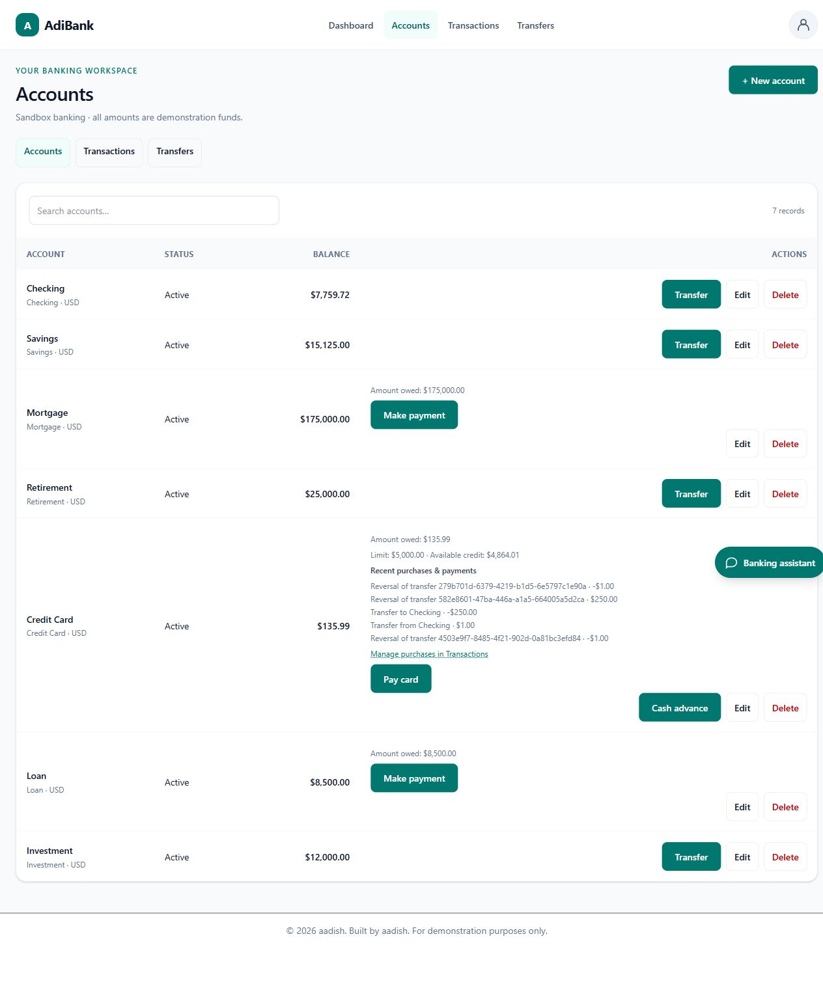

# Accounts, transactions, transfers, and cards

Updated October 5, 2026. Both roles manage their own records in Supabase mode. Admins additionally have the read-only directory; they cannot access another user's banking workspace. See [role comparison](AUTH_SETUP.md) and [security checks](SECURITY.md).

## Operations

| Records | Create | Read | Update | Delete/reverse |
| --- | --- | --- | --- | --- |
| Accounts | Any of seven types, zero balance, currency; card credit limit | Own balances/status; card debt and available credit | Name and active/frozen/closed status | Only zero-balance accounts without history |
| Transactions | Manual sandbox income/expense; card purchases | Latest 200 owned entries and local search | Manual amount, description, category | Undo the entry's balance effect if the resulting balance/credit remains valid |
| Transfers | Own active accounts in one currency | Latest 200 receipts, including archived reversals | Amount, adjusting both balances and generated entries | Reverse and archive; keep receipt, original entries, and reversal/audit history |

Checking, Savings, Retirement, and Investment can fund transfers up to available funds. Credit Card can fund advances up to limit minus debt, even when the amount exceeds its displayed balance. Mortgage and Loan accept payments only. Payments to debt accounts cannot exceed the amount owed. All accounts must be active, distinct, owned, and use matching currencies.

Credit-card purchases increase debt; payments reduce both source cash and destination debt. Cash advances increase debt and destination funds. The UI offers Transfer, Pay card/Make payment, and Cash advance controls as appropriate. A card source shows available credit and the borrowing explanation. No fees, interest, trading, or withdrawal penalties are simulated.

Opening, transfer, and reversal ledger entries are protected. A transaction's account, an account's type/currency, and an existing card limit cannot currently be changed through the editor. Direct card income entries are rejected: use Transfers for payments. Failed changes leave balances/ledger/audit effects unchanged. Retry IDs prevent duplicate operations and cannot be reused for changed details.

## Seeds and limits

The eight migrations in [database setup](BANKING_DATA_SETUP.md) are applied to the configured demo project. Repeatable activity and card seeds preserve later edits. To run only seeds on an already migrated sandbox:

~~~sh
npm run db:migrate -- --seed-only --activity --analytics-activity --credit-activity
~~~

Transaction/transfer lists search only the newest 200 loaded records; server filtering, pagination, and fuller record-detail screens remain future work. Analytics aggregates eligible full history independently of that limit. The grounded assistant and phone layouts are implemented; see [assistant](ASSISTANT.md), [analytics](ANALYTICS.md), and [responsive UI](RESPONSIVE_UI.md).

Screenshots show sample records. Public demo passwords appear only in the intentionally enabled login selector/capture; no service keys or database credentials are included. Verification transfers may leave reversal entries visible in history.

## Verification

npm run test:database validates atomic changes, RLS, credit boundaries, signed ledger reconciliation, retries, reversals, rollback, and active sessions. With the seeded app on localhost:3100, verify:crud and verify:credit-card exercise hosted sandbox mutations and restore balances while preserving reversal/audit history. verify:banking -- --app checks reads; verify:security checks authentication, roles, ownership, origin protection, and revoked-token access. Run mutation/read checks sequentially against demo data.
