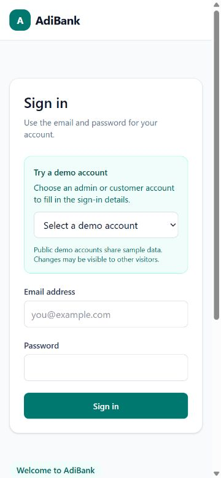
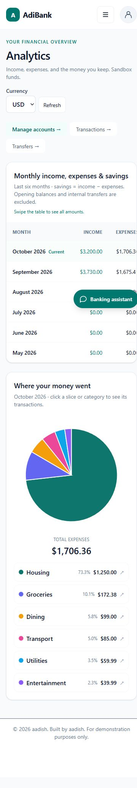
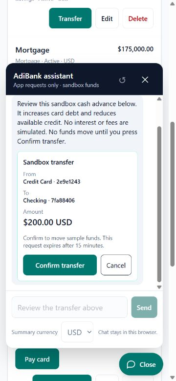

# Responsive interface

The minimum target is the iPhone 12 mini's 375 × 812 CSS-pixel portrait viewport, with layouts expanding for larger phones, tablets, and desktop screens.

- Compact header with a 44px navigation toggle and person-menu button. Mobile navigation opens as a two-column grid; desktop navigation remains inline.
- Login form appears first on phones. Mobile input/select text is 16px to avoid iOS focus zoom; shared controls have a 44px minimum height.
- Accounts, transactions, and transfers use stacked cards below 640px, with visible wrapping action buttons. Larger screens keep tables. Long names/descriptions wrap instead of expanding the page.
- Analytics retains the requested monthly table inside a keyboard-focusable horizontal scroll region. Pie and legend stack on phones. Category/transfer/delete dialogs fit the viewport and scroll internally.
- The assistant fits the viewport, separates scrolling messages from its fixed composer, respects safe-area insets, and adjusts to visual viewport/keyboard changes. The launcher has reserved footer space.
- Financial pages refresh after confirmed chat transfers. Uncertain transfers retain their retry confirmation through refresh.

Browser viewport checks are recorded in the implementation progress. Browser emulation does not certify physical iOS Safari behavior; a real-device check of the keyboard, safe areas, VoiceOver, and touch scrolling is still useful before release.

## Current captures — October 5, 2026

Phone screenshots use a 375 × 812 CSS-pixel viewport. They include the current seven-account workspace, transfer buttons, analytics, and card-aware assistant confirmation. Browser emulation is not a physical iPhone/Safari certification.

